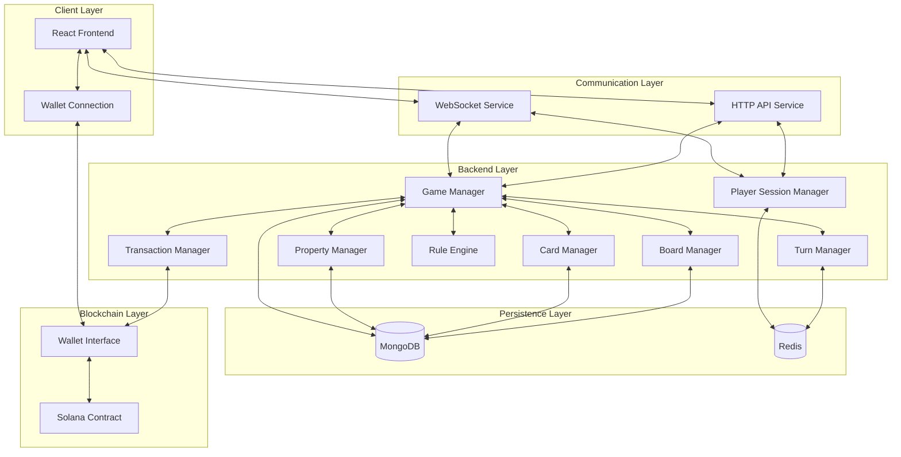
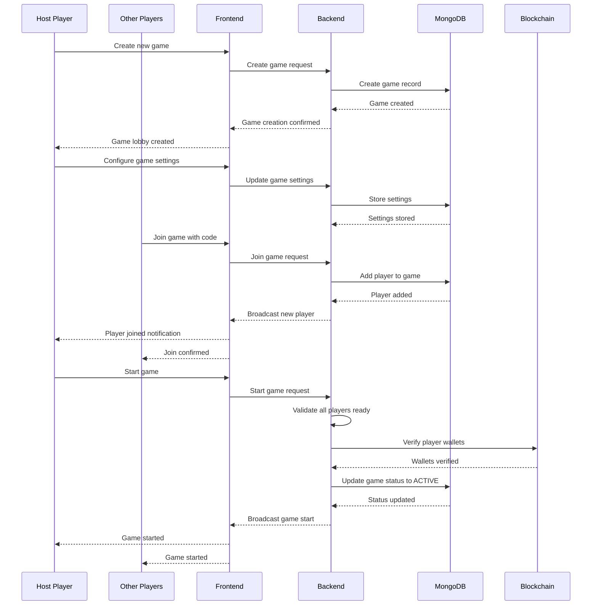
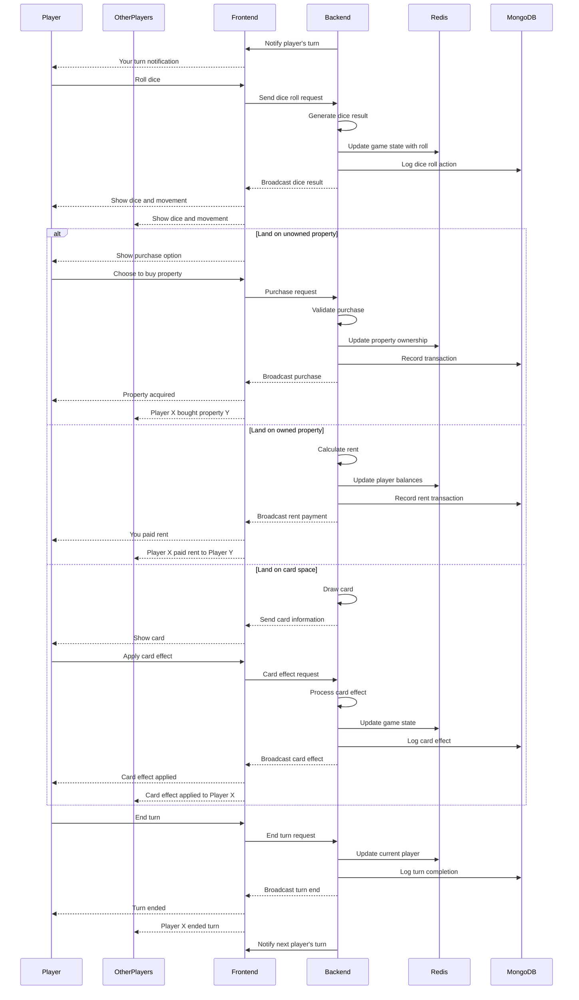
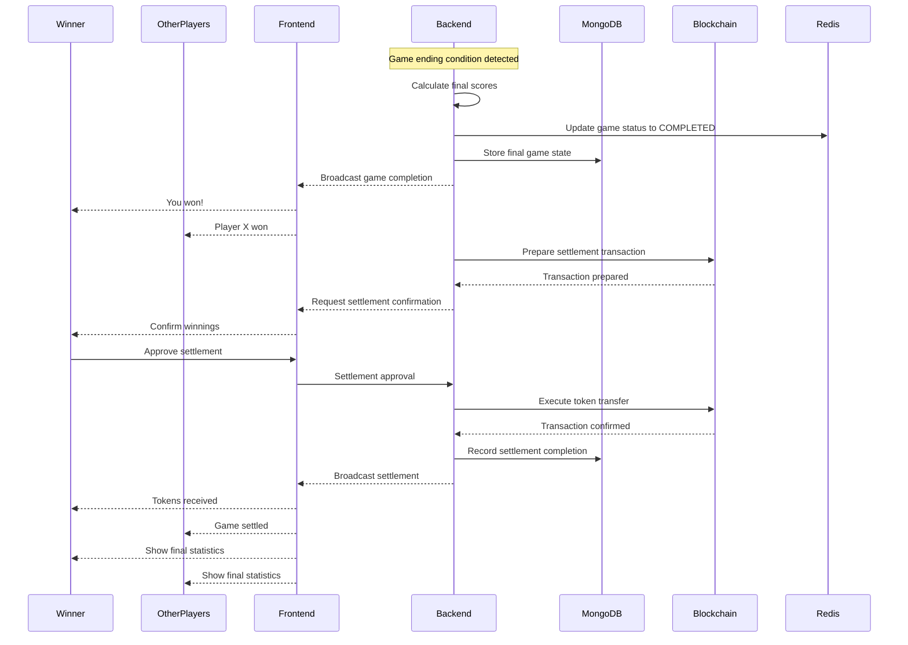
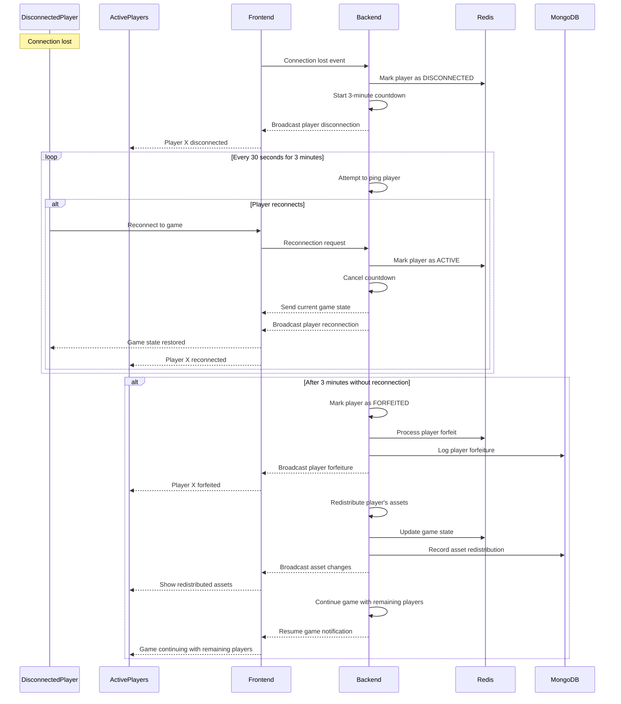
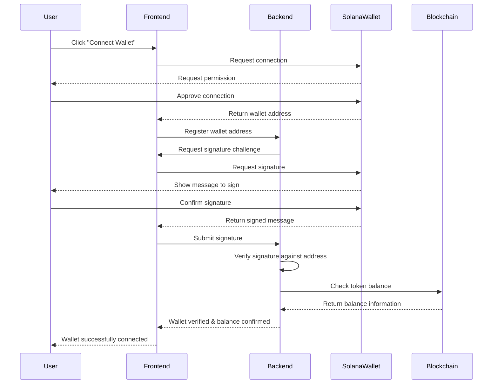
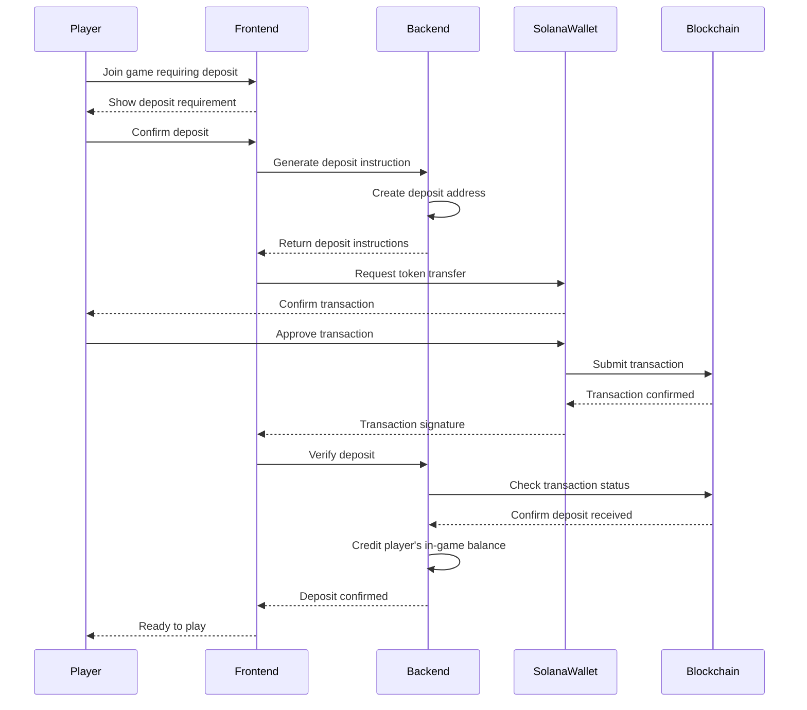
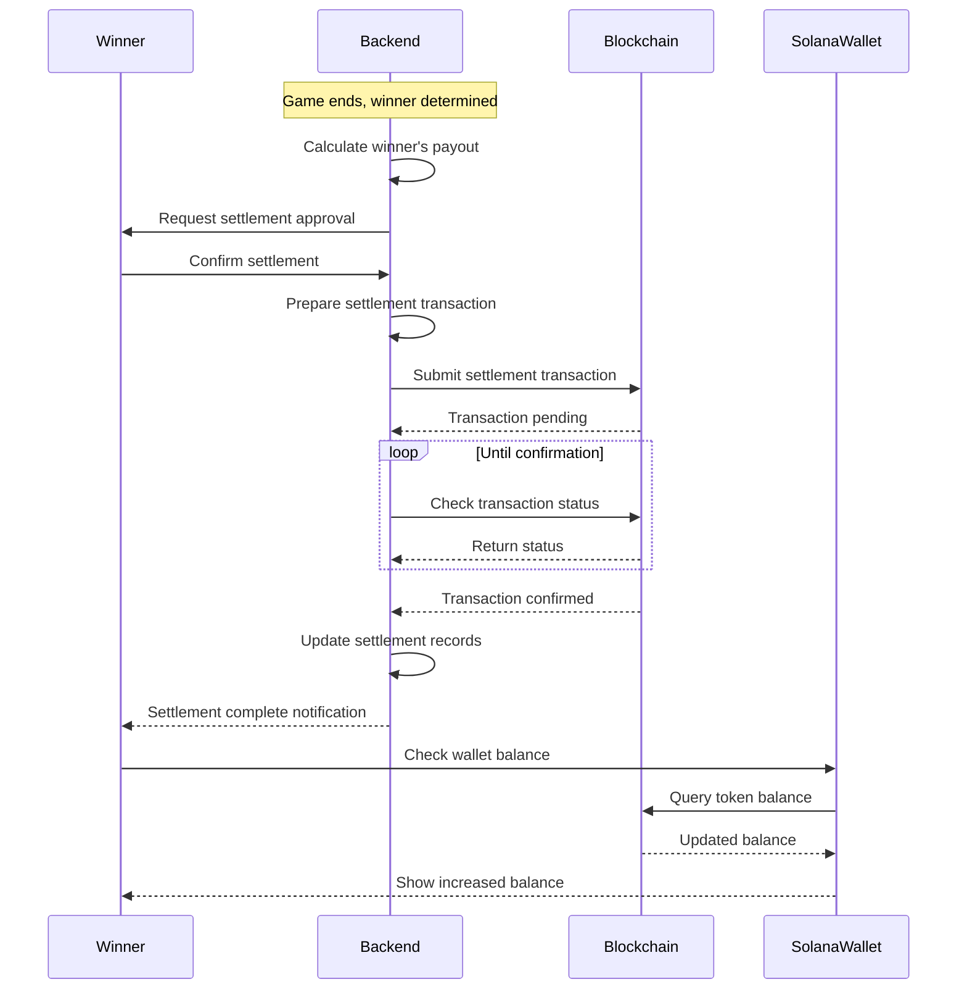

# Kekopoly: Game Architecture

## Table of Contents
1. [System Architecture](#system-architecture)
2. [Data Model and State Management](#data-model-and-state-management)
3. [Game Flow Sequences](#game-flow-sequences)
4. [Technical Requirements](#technical-requirements)
5. [API Endpoints](#api-endpoints)
6. [Blockchain Integration](#blockchain-integration)
7. [Disconnection Handling](#disconnection-handling)
8. [Security Considerations](#security-considerations)
9. [Scaling Strategy](#scaling-strategy)

## System Architecture

The Kekopoly game is built using a modern, scalable, and real-time architecture that combines web technologies with blockchain integration. The system is designed to support remote multiplayer gameplay with seamless blockchain transactions.

### High-Level Architecture Diagram



### Component Descriptions

#### Client Layer

- **React Frontend**: Main user interface built with React 18 and Chakra UI
- **Wallet Connection**: Integration with Solana wallet adapters (Phantom, Solflare, etc.)

#### Communication Layer

- **WebSocket Service**: Real-time game state updates and events using Socket.io
- **HTTP API Service**: RESTful API for game management, authentication, and non-real-time operations

#### Backend Layer

- **Game Manager**: Coordinates overall game flow and rules enforcement
- **Player Session Manager**: Handles player connections, disconnections, and session persistence
- **Turn Manager**: Controls turn order, actions, and timeout handling
- **Property Manager**: Manages property ownership, rent calculations, and building placements
- **Card Manager**: Handles card decks, drawing, and effect application
- **Rule Engine**: Implements game rules, special cases, and condition validation
- **Board Manager**: Manages the game board state, player positions, and space actions
- **Transaction Manager**: Coordinates in-game transactions and blockchain operations

#### Persistence Layer

- **MongoDB**: Long-term storage for game state, player data, and transaction history
- **Redis**: In-memory cache for active games, sessions, and real-time state

#### Blockchain Layer

- **Solana Contract**: Smart contract for token operations and game settlements
- **Wallet Interface**: Abstraction for wallet API interactions and transaction signing

## Data Model and State Management

### Core Data Models

#### Game Entity
```json
{
  "gameId": "string",
  "status": "enum(LOBBY, ACTIVE, PAUSED, COMPLETED)",
  "createdAt": "timestamp",
  "updatedAt": "timestamp",
  "players": ["playerRefs"],
  "currentTurn": "playerId",
  "turnOrder": ["playerIds"],
  "boardState": {
    "properties": ["propertyStateRefs"],
    "cardsRemaining": {
      "meme": "number",
      "redpill": "number",
      "eegi": "number"
    }
  },
  "lastActivity": "timestamp",
  "marketCondition": "enum(NORMAL, BULL, CRASH)",
  "marketConditionRemainingTurns": "number",
  "winnerId": "playerId|null",
  "settlementStatus": "enum(PENDING, IN_PROGRESS, COMPLETED, FAILED)"
}
```

#### Player Entity
```json
{
  "playerId": "string",
  "userId": "string",
  "walletAddress": "string",
  "walletSignature": "string",
  "characterToken": "string",
  "position": "number",
  "balance": "number",
  "cards": [{
    "cardId": "string",
    "cardType": "enum(MEME, REDPILL, EEGI)",
    "rarity": "enum(COMMON, RARE, LEGENDARY)",
    "name": "string"
  }],
  "shadowbanned": "boolean",
  "shadowbanRemainingTurns": "number",
  "status": "enum(ACTIVE, DISCONNECTED, BANKRUPT, FORFEITED)",
  "disconnectedAt": "timestamp|null",
  "properties": ["propertyIds"],
  "initialDeposit": "number",
  "netWorth": "number"
}
```

#### Property Entity
```json
{
  "propertyId": "string",
  "name": "string",
  "type": "enum(REGULAR, TRANSIT, UTILITY, SPECIAL)",
  "group": "string",
  "position": "number",
  "ownerId": "playerId|null",
  "price": "number",
  "rentBase": "number",
  "rentCurrent": "number",
  "mortgaged": "boolean",
  "engagements": "number",
  "blueCheckmark": "boolean",
  "specialEffects": [{
    "type": "string",
    "appliedBy": "playerId",
    "expiresAfterTurns": "number"
  }],
  "memeName": "string|null"
}
```

#### Transaction Entity
```json
{
  "transactionId": "string",
  "gameId": "string",
  "type": "enum(PURCHASE, RENT, CARD_EFFECT, SALARY, PENALTY, GAME_SETTLEMENT, DEPOSIT)",
  "fromPlayerId": "string|null",
  "toPlayerId": "string|null",
  "amount": "number",
  "propertyId": "string|null",
  "cardId": "string|null",
  "timestamp": "timestamp",
  "onChainStatus": "enum(PENDING, COMPLETED, FAILED)",
  "onChainTxId": "string|null",
  "signature": "string|null"
}
```

#### Card Entity
```json
{
  "cardId": "string",
  "name": "string",
  "type": "enum(MEME, REDPILL, EEGI)",
  "rarity": "enum(COMMON, RARE, LEGENDARY)",
  "effect": "string",
  "description": "string",
  "imageUrl": "string"
}
```

### State Management Approach

#### Layered State Architecture

The system uses a layered approach to state management:

1. **Frontend State Layer**:
   - Redux Toolkit for client-side state management
   - Organized into slices for different game aspects (board, properties, players, cards)
   - Optimistic UI updates for responsive user experience
   - Local states for UI-specific components

2. **Synchronization Layer**:
   - Socket.io for real-time updates between clients and server
   - Event-based communication for game actions
   - Broadcast, direct, and room-based messaging patterns

3. **Persistence Layer**:
   - Redis for fast, in-memory active game states
   - MongoDB for durable storage and historical data
   - Transaction journal for audit and recovery

4. **Blockchain Layer**:
   - Read-only state synchronization for token balances
   - Transaction preparation and signing
   - Settlement verification

#### State Synchronization Strategy

1. **Initialization**:
   - Full state loaded from MongoDB at game start
   - Active state maintained in Redis
   - Frontend receives complete initial state

2. **Regular Updates**:
   - Delta updates sent via WebSockets for efficiency
   - Periodic full state synchronization to prevent drift
   - Critical actions verified server-side before state changes

3. **Conflict Resolution**:
   - Server is the source of truth for game state
   - Client predictions with server validation
   - Version vector for state reconciliation

4. **Persistence Strategy**:
   - Write-ahead logging for critical operations
   - Snapshots at significant game milestones
   - Transaction journal for complete history

## Game Flow Sequences

### Game Initialization Sequence



### Player Turn Sequence



### Game Completion Sequence



### Disconnection Handling Sequence



## Technical Requirements

### Frontend Requirements

#### Development Environment
- Node.js v18+
- npm/yarn package manager
- Vite build system

#### Core Dependencies
- React 18+
- Redux Toolkit & RTK Query
- Socket.io client
- Chakra UI component library
- Solana Web3.js
- Solana Wallet Adapter
- Framer Motion (animations)
- Axios (HTTP client)
- date-fns (date utilities)
- uuid (unique identifiers)

#### Testing Dependencies
- Jest
- React Testing Library
- MSW (Mock Service Worker)
- Cypress (E2E testing)

#### Build & Deploy
- ESLint + Prettier
- Husky (pre-commit hooks)
- GitHub Actions CI pipeline
- Docker containerization

#### Browser Compatibility
- Modern browsers (Chrome, Firefox, Safari, Edge)
- Minimum 2 most recent major versions
- Responsive design for desktop and tablet devices

### Backend Requirements

#### Development Environment
- Go 1.20+
- Docker & Docker Compose
- Make

#### Core Dependencies
- Echo web framework
- gorilla/websocket
- golang-jwt/jwt
- Solana-go
- MongoDB Go driver
- Redis client for Go
- zap (logging)
- Viper (configuration)

#### Testing Dependencies
- testify
- mockery
- sqlmock

#### Build & Deploy
- golangci-lint
- GitHub Actions CI pipeline
- Docker multi-stage builds
- Kubernetes manifests

### Infrastructure Requirements

#### Development
- Local Docker environment
- MongoDB & Redis containers
- Solana devnet connection

#### Production
- Kubernetes cluster
- Load balancer
- SSL termination
- Scheduled backups
- Auto-scaling configuration

#### Monitoring & Logging
- Prometheus metrics
- Grafana dashboards
- ELK or Loki stack
- Uptime monitoring
- Alert system

#### Security
- Web Application Firewall
- DDoS protection
- Rate limiting
- API key management
- Secret management (HashiCorp Vault)

### Database Requirements

#### MongoDB
- Version 5.0+
- Replica set for high availability
- Sharding for large-scale deployments
- Index strategy for query optimization
- TTL indexes for temporary data
- Schema validation

#### Redis
- Version 6.2+
- Redis Sentinel or Redis Cluster
- Persistence configuration (RDB + AOF)
- Eviction policies
- Connection pooling
- Lua scripting for complex operations

## API Endpoints

### Authentication & User Management

```
POST /api/v1/auth/register
POST /api/v1/auth/login
POST /api/v1/auth/wallet-connect
GET  /api/v1/auth/refresh-token
POST /api/v1/auth/logout
GET  /api/v1/user/profile
PATCH /api/v1/user/profile
GET  /api/v1/user/wallet
POST /api/v1/user/wallet/verify
```

### Game Management

```
POST /api/v1/games                   # Create new game
GET  /api/v1/games                   # List available games
GET  /api/v1/games/{gameId}          # Get game details
POST /api/v1/games/{gameId}/join     # Join game
POST /api/v1/games/{gameId}/leave    # Leave game
POST /api/v1/games/{gameId}/start    # Start game
POST /api/v1/games/{gameId}/pause    # Pause game
GET  /api/v1/games/{gameId}/state    # Get current game state
```

### Game Actions

```
POST /api/v1/games/{gameId}/actions/roll-dice
POST /api/v1/games/{gameId}/actions/buy-property
POST /api/v1/games/{gameId}/actions/pay-rent
POST /api/v1/games/{gameId}/actions/draw-card
POST /api/v1/games/{gameId}/actions/use-card
POST /api/v1/games/{gameId}/actions/mortgage-property
POST /api/v1/games/{gameId}/actions/unmortgage-property
POST /api/v1/games/{gameId}/actions/build-engagement
POST /api/v1/games/{gameId}/actions/build-checkmark
POST /api/v1/games/{gameId}/actions/end-turn
POST /api/v1/games/{gameId}/actions/trade                # Initiate trade
POST /api/v1/games/{gameId}/actions/trade/{tradeId}/respond  # Accept/reject trade
POST /api/v1/games/{gameId}/actions/special/{actionId}   # Perform special action
```

### WebSocket Events

#### Client to Server Events

```
join_game:
  gameId: string
  playerId: string
  walletAddress: string
  walletSignature: string
  
reconnect:
  gameId: string
  playerId: string
  sessionId: string
  
roll_dice:
  gameId: string
  playerId: string
  
buy_property:
  gameId: string
  playerId: string
  propertyId: string
  
end_turn:
  gameId: string
  playerId: string
  
use_card:
  gameId: string
  playerId: string
  cardId: string
  targetPlayerId?: string
  targetPropertyId?: string
  
propose_trade:
  gameId: string
  fromPlayerId: string
  toPlayerId: string
  offeringProperties: string[]
  offeringCards: string[]
  offeringKekels: number
  requestingProperties: string[]
  requestingCards: string[]
  requestingKekels: number
  
respond_trade:
  gameId: string
  tradeId: string
  playerId: string
  accepted: boolean
  
chat_message:
  gameId: string
  playerId: string
  message: string
```

#### Server to Client Events

```
game_state_update:
  gameId: string
  state: GameState
  
player_joined:
  gameId: string
  player: PlayerDetails
  
player_left:
  gameId: string
  playerId: string
  
player_reconnected:
  gameId: string
  playerId: string
  
player_disconnected:
  gameId: string
  playerId: string
  countdownRemaining: number
  
player_forfeited:
  gameId: string
  playerId: string
  
dice_rolled:
  gameId: string
  playerId: string
  dice: [number, number]
  doubleRoll: boolean
  newPosition: number
  
property_purchased:
  gameId: string
  playerId: string
  propertyId: string
  price: number
  
rent_paid:
  gameId: string
  fromPlayerId: string
  toPlayerId: string
  propertyId: string
  amount: number
  
card_drawn:
  gameId: string
  playerId: string
  cardType: string
  cardDetails: CardDetails
  
card_used:
  gameId: string
  playerId: string
  cardId: string
  effect: string
  affectedPlayers: string[]
  affectedProperties: string[]
  
turn_changed:
  gameId: string
  playerId: string
  turnNumber: number
  
trade_proposed:
  gameId: string
  tradeId: string
  fromPlayerId: string
  toPlayerId: string
  details: TradeDetails
  
trade_completed:
  gameId: string
  tradeId: string
  fromPlayerId: string
  toPlayerId: string
  success: boolean
  
game_paused:
  gameId: string
  reason: string
  
game_resumed:
  gameId: string
  
game_completed:
  gameId: string
  winnerId: string
  finalStandings: PlayerStanding[]
  
settlement_initiated:
  gameId: string
  settlementId: string
  
settlement_completed:
  gameId: string
  settlementId: string
  winnerId: string
  amount: number
  transactionId: string
```

## Blockchain Integration

### Solana Wallet Integration Architecture

The Kekopoly game integrates with Solana blockchain wallets to enable secure token operations for game entry and winnings settlement.

#### Wallet Connection Flow



#### Wallet Verification Process

1. **Connection Phase**:
   - Frontend uses Solana Wallet Adapter to detect available wallet extensions
   - User selects their preferred wallet (Phantom, Solflare, etc.)
   - Wallet adapter establishes connection and provides public key

2. **Authentication Phase**:
   - Backend generates a unique challenge message with timestamp and nonce
   - Frontend requests user to sign this message with their wallet
   - Signature and original message are sent to backend
   - Backend verifies the signature matches the wallet address
   - Upon verification, a JWT token is issued to authorize subsequent requests

3. **Verification Lifecycle**:
   - Authentication valid for one gaming session
   - Periodic re-verification during long sessions
   - Signature checks before critical operations
   - Session invalidation on suspicious activity

4. **Security Measures**:
   - Time-limited challenge messages
   - Prevention of challenge reuse
   - Rate limiting on verification attempts
   - Multi-factor authentication for high-value games

### Token Deposit and Settlement Mechanism

The token economy operates on Solana blockchain using Kekels Meme Tokens (KMT).

#### Initial Deposit Flow



#### Game Settlement Flow



#### Technical Implementation Details

1. **Smart Contract Design**:
   - SPL token contract for KMT tokens
   - Escrow contract for game deposits
   - Settlement contract for winner payouts
   - Safety timelock mechanism for disputed outcomes

2. **Transaction Management**:
   - Batched transactions for efficiency
   - Transaction retry mechanism
   - Fee management for optimal cost
   - Transaction monitoring
   - Failure recovery procedures

3. **Token Management**:
   - Balance checking before game entry
   - Atomic deposit operations
   - Secure custody of in-game tokens
   - Multiple signature requirement for large payouts

4. **Balance Reconciliation**:
   - Regular blockchain-to-database balance checks
   - Automated discrepancy detection
   - Reconciliation procedures for mismatches

5. **Security Measures**:
   - Cold storage for majority of tokens
   - Hot wallet with limited funds for fast operations
   - Multi-signature requirements for large withdrawals
   - Regular security audits of wallet code

## Disconnection Handling

The Kekopoly game implements a robust disconnection handling system to ensure game continuity while providing reasonable opportunity for players to reconnect.

### Disconnection Detection and Management Process

1. **Detection Phase**:
   - WebSocket heartbeat mechanism detects broken connections
   - Client-side reconnection attempts automatically on disconnect
   - User-initiated reconnects supported through reconnection API

2. **Grace Period Phase**:
   - When disconnection detected, player marked as DISCONNECTED
   - 3-minute countdown timer initiated
   - Periodic ping attempts to disconnected client
   - Other players notified of disconnection with countdown
   - Game paused if disconnection occurs during player's turn

3. **Reconnection Phase**:
   - If player reconnects within 3 minutes:
     - Player status restored to ACTIVE
     - Full game state sent to reconnected player
     - Game resumed from previous state
     - Other players notified of successful reconnection

4. **Forfeiture Phase**:
   - If player fails to reconnect within 3 minutes:
     - Player status changed to FORFEITED
     - Player's assets managed according to forfeiture rules
     - Game continues with remaining players
     - Forfeited player cannot rejoin this game instance

### Asset Handling Upon Forfeiture

1. **Property Disposition**:
   - Unmortgaged properties revert to unowned status (available for purchase)
   - Mortgaged properties stay mortgaged but become available for purchase at mortgage value
   - Houses and hotels (Engagements and Blue Checkmarks) remain on properties

2. **Token Distribution**:
   - Forfeited player's Kekels remain in the game economy
   - If player was winning, their potential winnings are redistributed to remaining players
   - Initial deposit is forfeit and added to the final winner's payout

3. **Special Handling**:
   - Get Out of Jail (Verification) cards return to respective decks
   - Active special effects applied by the player remain in effect until expiration
   - Pending trades are automatically cancelled

### Recovery Mechanisms

1. **Session Management**:
   - Unique session tokens identify specific game connections
   - Sessions persist across temporary disconnections
   - Players can authenticate and recover their previous game state

2. **State Recovery**:
   - Full game state snapshot provided on reconnection
   - Catch-up mechanism for missed events
   - Transaction log replay if needed for consistency

3. **Dispute Resolution**:
   - Admin tools for manual intervention in edge cases
   - Game state history available for review
   - Blockchain record of deposits for verification

## Security Considerations

### Authentication & Authorization

1. **User Authentication**:
   - JWT-based authentication with refresh tokens
   - Password-less wallet-based authentication
   - Rate limiting on authentication attempts
   - Session management with appropriate timeouts

2. **Wallet Security**:
   - Challenge-response signature verification
   - No private keys stored server-side
   - Wallet-signed transactions only
   - Regular re-authentication for sensitive operations

3. **API Authorization**:
   - Role-based access control
   - Scoped API tokens
   - Operation-level permissions
   - IP-based restrictions for admin functions

### Game Integrity

1. **Anti-Cheat Measures**:
   - Server-side validation of all game actions
   - Cryptographically secure random number generation
   - Server-authoritative game state
   - Action replay protection
   - Rate limiting on game actions

2. **Game State Protection**:
   - Transaction logs for state changes
   - Database-level constraints and validations
   - Immutable event history
   - Periodic state consistency checks

3. **Economic Safeguards**:
   - Maximum bet/wager limits
   - Automated unusual activity detection
   - Circuit breakers for extreme market conditions
   - Admin alerts for suspicious patterns

### Infrastructure Security

1. **Network Security**:
   - TLS for all connections
   - API Gateway with WAF protection
   - DDoS mitigation
   - Network segmentation
   - Regular security scans

2. **Data Protection**:
   - Encryption at rest for sensitive data
   - Secure key management
   - Regular backups with encryption
   - Data retention policies

3. **Operational Security**:
   - Least privilege access model
   - Audit logging of admin actions
   - Automated security testing in CI/CD
   - Regular penetration testing

## Scaling Strategy

### Horizontal Scaling

1. **Game Server Scaling**:
   - Game instances distributed across multiple servers
   - Game sharding by region or load
   - Stateless API servers with auto-scaling
   - Load balancer distribution

2. **Database Scaling**:
   - MongoDB sharding for game data
   - Read replicas for high-read operations
   - Redis cluster for distributed caching
   - Database connection pooling

3. **WebSocket Scaling**:
   - Socket.io with Redis adapter for cross-server messaging
   - Socket connection distribution with sticky sessions
   - Separate WebSocket servers from API servers
   - Gradual scaling based on connection count

### Performance Optimization

1. **Data Access Patterns**:
   - Caching strategy for frequently accessed data
   - Denormalized data models for game state
   - Indexing strategy for common queries
   - Batch operations for multiple updates

2. **Network Optimization**:
   - CDN for static assets
   - WebSocket message compression
   - Partial updates rather than full state transfers
   - Binary protocols for efficient data transfer

3. **Resource Management**:
   - Connection pooling for database and services
   - Graceful degradation under high load
   - Resource quotas per game/player
   - Background processing for non-critical operations

### Monitoring & Capacity Planning

1. **Key Metrics**:
   - Active games and players
   - WebSocket connections and message rate
   - Database operation latency
   - API response times
   - Blockchain transaction success rate

2. **Auto-scaling Triggers**:
   - Connection count thresholds
   - CPU/Memory utilization
   - Queue depth
   - Error rate

3. **Capacity Planning**:
   - Historical usage analysis
   - Predictive scaling for peak times
   - Resource reservation for critical services
   - Incremental infrastructure growth